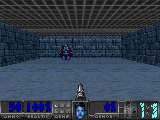

# PAAC DOOM
This is a fork of [PAAC](https://github.com/Alfredvc/paac) to work with [VizDoom](http://vizdoom.cs.put.edu.pl/)

VizDoom needs to be installed. For other requirements see the original repository.

Scenarios needs to be changed from code. Same with the buttons used. Changing the game from command line doesn't do anything.

Add different VizDoom scenarios to directory /scenarios

Example command for training:
python3 train.py -ec 32 -ew 16 -df log_dir

Example command for generating gifs:
python3 test.py -f log_dir -tc 5 -gn gif_name

